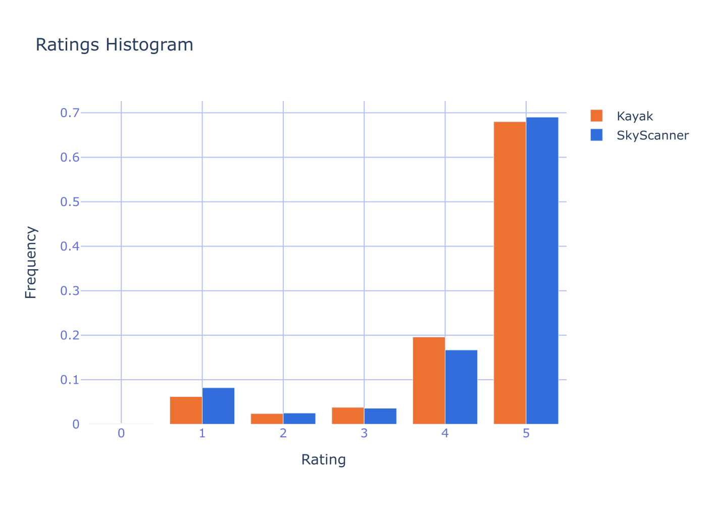
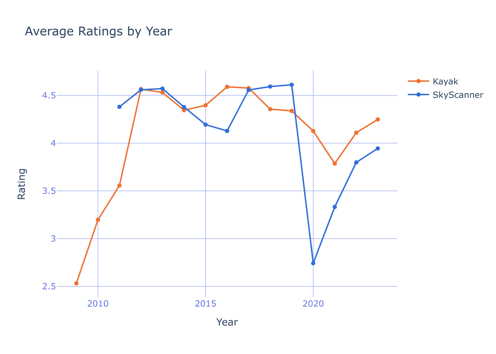

# SES216 - Quantux - Quantative Data Analysis for Flight Comparator Apps

## The goal of this analysis
The goal of this analysis is to find useful feedback for Flight Comparator Applications. We want to find a way to extract UX related feedback from a huge pool of reviews, we’ll do this analysis on the Skyscanner and Kayak applications.


### Quick remarks
We can’t really retrieve all the reviews for an app that we aren’t the owner of, but I managed to extract a reasonable amount of reviews for both of the applications (about 50K reviews each). 


## Review scraping
For the scraping of the reviews, I used a simple python package named google-play-scraper to retrieve the reviews. I then cleaned them a bit (removed some non latin reviews while keeping the emoji’s).

## Sentiment processing
Since I am a beginner in sentiment analysis and natural language processing, I only did some basic processing.
I decided to use an artificial intelligence pre-trained model to do sentiment analysis on the data. I first used Nltk(Natural Language Toolkit) pre-trained sentiment analysis to run on the reviews, but the model wasn’t picking up on subtleties and didn’t give accurate results. I found the twitter-roberta-base-sentiment trained on 58~ millions tweets and fine tuned for sentiment analysis. It gave me much more accurate scores.
The model gave for every review three scores: a positive, neutral and  negative score.

## Quick outline


Kayak and Skyscanner were both created around the years 2003-2004. Skyscanner has attracted 5 times more google play store downloads than Kayak.




Both of the two applications have a similar ratings histogram and around the same mean rating (4.8 for Kayak and 4.7 for Skyscanner at the date of this report)


## What can you do with this

With this amount of data, you can’t read all the reviews one by one, so you need a way to extract interesting feedback from all the reviews.
The cleaned data is enough to do most of the work to extract feedback, but sentiment analysis really supercharges the analysis and helps us find good feedback quicker, and that matters a lot when you deal with a humongous amount of data.
For example, filtering the reviews depending on dates and certain updates already give back important information, but with the different scores really help surfacing most critical 5 star reviews or most positive 1 star reviews.

### First analysis : Skyscanner 2020 update
Plotting the average rating per year for the two different applications gives us an interesting result. What can we conclude with only the reviews ?





With the analyzed reviews, you can easily find problems, but before you need a bit of filtering so you don’t end up with feedback you don’t really care about. For this update, we want to get the feedback for the UI and design, and not for the customer service, flight cancellations, etc…
After a bit of filtering with end up with theses : 

```I hate the app since the last update. I tried to get used to it, but the user experience and the lack of features compared to the previous app plus the bad customer service when you face an issue made me uninstall this app. You made a bad business decision ! ```

```Skyscanner seems to get worse and worse every time I use it. It's trying to do too much.```

```What the hell happened?! It was one of my most used tools and now either I am too stupid to make a basic search or you made it so complicated it makes me want to throw my phone away. Please change this new interface pronto!```

```The last update is very bad .. flexible dates chart not exist anymore ..so annoying and the app being same the other apps```

And this is only a fraction of the reviews you can find that exactly points out what is the UX/UI issue about this update. 

### Second analysis : For the designers
I see this second analysis as a way for designers to find feedback on the things they work on. Because sometimes, it is quite hard to know what is good or not, even with A B testing, and more with smartphone applications design, because A B testing is less easy then for websites.
	Something I discovered is that in these great piles of reviews, most of them are useless and complain about things that designers don’t care about. Because most of the reviews are about the app’s not launching after an update, or bugs that are more for engineers than for designers.
With this in mind, I'll give some review examples that I found using the data I collected and processed to give you insight on how it is resourceful.

#### Feedback about the calendar for example: 

```Won't be using until they add whole calendar view, which is the most useful setting on the browser site. ```

```It is nice app. searches wide variety of ticket provider and recommends better rates. can you make one improvement- during flight search i always need to select the date. can you provide next and previous date navigations. say im searching flight for 6 november and i don't find one suiting my choice then i can select next and previous and it shows data of 7 nov or 5 nov date and so on. currently i have open the calendar select 7 nov```

```Does not show prices of flights for whole months like on the website, witch is the only reason i use skyscanner. the app only shows range of prices and you have to choose the dates to see the prices instead of choosing date after seeing prices on the calendar. i guess i will have to keep using the website if i want to use skyscanner services.```

```what was once a simple app is becoming cluttered and unituive. people that use this model want simplicity and value speed but now theres too much going on. when searching, what has happened to searching for a whole month and when using explore to search for a whole month, you don't get a calendar to choose from but a list of already selected flights. the whole reason i use skyscanner is to see that calendar view to choose specific dates and compare.```


#### Feedback about the search : 

 ```I hate the new update, they've taken away the multi city search and you can't change cabin class! why remove functionality? deleted.```

 ```Hate the new look.. i can not select multiple passengers on my search.. also page layout crappy .. don't like it anymore```

 ```the last update is so disappointing. logo looks like weather app. start up flight searching separated pages (dates, where to, from where) are inconvenient. please, revert to previous searching modes as before using convenient search from 1 page all-in-one: date, to, from, quantity of passengers etc.```

## Quantitative Data Analysis Conclusion
The App Store reviews hold a lot of useless reviews by frustrated customers, but if you dig a lot and with the right tools, you can eventually extract useful and resourceful reviews.
With the example of Kayak and Skyscanner, that even long lasting apps supported by great corporations can still have flaws, and that the flaws can be pinpointed with the help of store reviews and sentiment analysis

You can find all the material used for this analysis on this [link](https://github.com/comeyrd/UX-FlightComparator). You’ll find the scripts, data and the below report.
